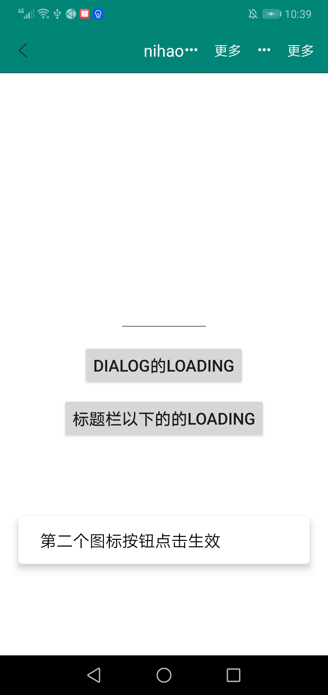
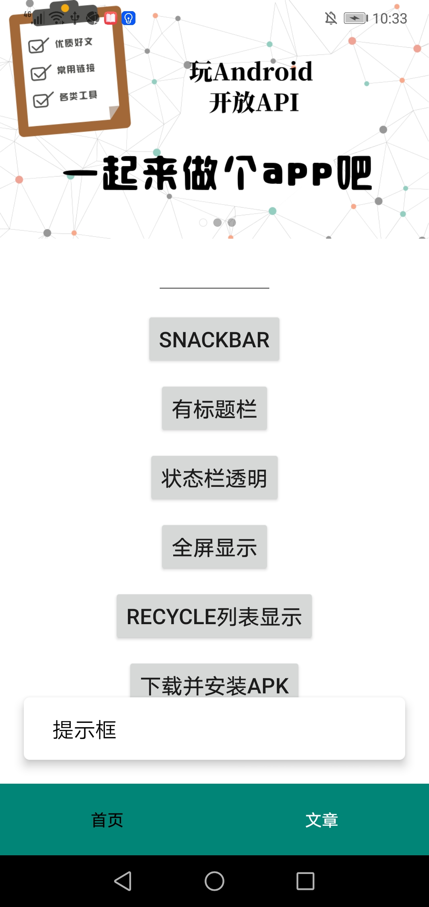

## 技术要点

+ ### 支持Flow+Retrofit+OkHttp实现链式http请求

+ ### 支持Rxjava+Retrofit+OkHttp实现链式http请求

+ ### 全局配置网络加载错误页面,并支持重新加载数据

+ ### 全局配置列表空页面

+ ### 封装基类:BaseActivity、BaseVMActivity、BaseFragment、BaseVMFragment、RecycleAdapter、BaseViewModel

+ ### 引入LifeCycle，将ViewModel和Activity的生命周期绑定在一起

+ ### 使用startup库将在Application中初始化移至到[KotlinMvvmInitializer](./mvvm/src/main/java/com/catchpig/mvvm/initializer/KotlinMvvmInitializer.kt)中,从而不用封装BaseApplication

+ ### APT(编译时注解)封装注解：Title、OnClickFirstDrawable、OnClickFirstText、OnClickSecondDrawable、OnClickSecondText、Prefs、PrefsField、StatusBar、FlowError、GlobalConfig、ServiceApi

+ ### 封装工具扩展类：CalendarExt、ContextExt、DateExt、EditTextExt、GsonExt、RxJavaExt、StringExt、SnackbarExt

## 架构图
<image src="./images/架构图.png" style="zoom:80%;"/>

## 最低兼容:21


## release版本


## snapshot版本


# [Gitee](https://gitee.com/catchpig/kmvvm)

# [Github](https://github.com/catchpig/kmvvm)

## [CHANGE LOG](./CHANGE_lOG.md)

## Gradle

### 1. 在根目录的build.gradle中添加
```groovy
plugins {
    id 'org.jetbrains.kotlin.jvm' version "1.7.20" apply false
    id 'org.jetbrains.kotlin.multiplatform' version '1.7.20' apply false
    id 'org.jetbrains.kotlin.plugin.serialization' version '1.7.20' apply false
}
```
### 2. 在app的build.gradle中添加

```groovy
plugins {
    id 'kotlinx-serialization'

    id "com.google.devtools.ksp" version "1.7.20-1.0.7"
}
```
### 3. 在app的gradle.properties中添加
+ 停用ksp增量编译
```properties
ksp.incremental=false
```

### 3. 在app的build.gradle的android下添加

```groovy
buildFeatures {
    viewBinding = true
}
```

### 4. 添加依赖

```groovy
implementation "io.github.catchpig.kmvvm:mvvm:last_version"
ksp "io.github.catchpig.kmvvm:compiler:last_version"
```

> 需要使用下载功能,请单独添加如下依赖

```groovy
implementation "io.github.catchpig.kmvvm:download:last_version"
```

### 5. 使用快照版本的,需要添加如下maven地址

```groovy
maven {
    // mavenCentral的快照地址
    url 'https://s01.oss.sonatype.org/content/repositories/snapshots/'
}
```

## 使用

### 1. 配置全部参数

```kotlin
interface IGlobalConfig {
    /**
     * 标题栏高度
     * @return Int
     */
    @DimenRes
    fun getTitleHeight(): Int

    /**
     * 标题栏的返回按钮资源
     * @return Int
     */
    @DrawableRes
    fun getTitleBackIcon(): Int

    /**
     * 标题栏背景颜色
     * @return Int
     */
    @ColorRes
    fun getTitleBackground(): Int

    /**
     * 标题栏文本颜色
     * @return Int
     */
    @ColorRes
    fun getTitleTextColor(): Int

    /**
     * 标题栏下方是否需要横线
     * @return Boolean
     */
    fun isShowTitleLine(): Boolean

    /**
     * 标题栏下方横线颜色
     * @return Int
     */
    @ColorRes
    fun getTitleLineColor(): Int

    /**
     * loading的颜色
     * @return Int
     */
    @ColorRes
    fun getLoadingColor(): Int

    /**
     * loading的背景颜色
     * @return Int
     */
    @ColorRes
    fun getLoadingBackground(): Int

    /**
     * RecyclerView的空页面ViewBinding
     * @param parent ViewGroup
     * @return ViewBinding
     */
    fun getRecyclerEmptyBanding(parent: ViewGroup): ViewBinding

    /**
     * 网络请求失败的显示页面
     * @param layoutInflater LayoutInflater
     * @param any Any BaseActivity or BaseFragment
     * @return ViewBinding
     */
    fun getFailedBinding(layoutInflater: LayoutInflater, any: Any): ViewBinding?

    /**
     * 失败页面,需要重新加载的点击事件的id
     * @return Int
     */
    @IdRes
    fun onFailedReloadClickId(): Int
    
    /**
     * 刷新每页加载个数
     * @return Int
     */
    fun getPageSize(): Int

    /**
     * 刷新起始页的index(有些后台设置的0,有些后台设置1)
     */
    fun getStartPageIndex(): Int
}
```

+ 实现[IGlobalConfig](./annotation/src/main/java/com/catchpig/annotation/IGlobalConfig.kt)
  接口,并在实现类上加上注解[GlobalConfig](./annotation/src/main/java/com/catchpig/annotation/GlobalConfig.kt)

> 使用示例:

```kotlin
@GlobalConfig
class MvvmGlobalConfig : IGlobalConfig {
    override fun getTitleHeight(): Int {
        return R.dimen.title_bar_height
    }

    override fun getTitleBackIcon(): Int {
        return R.drawable.back_black
    }

    override fun getTitleBackground(): Int {
        return R.color.colorPrimary
    }

    override fun getTitleTextColor(): Int {
        return R.color.white
    }

    override fun isShowTitleLine(): Boolean {
        return true
    }

    override fun getTitleLineColor(): Int {
        return R.color.color_black
    }

    override fun getLoadingColor(): Int {
        return R.color.color_black
    }

    override fun getLoadingBackground(): Int {
        return R.color.white
    }

    override fun getRecyclerEmptyBanding(parent: ViewGroup): ViewBinding {
        return LayoutEmptyBinding.inflate(LayoutInflater.from(parent.context), parent, false)
    }
    
    override fun getFailedBinding(layoutInflater: LayoutInflater, any: Any): ViewBinding? {
        return when (any) {
            is BaseActivity<*> -> {
                LayoutActivityErrorBinding.inflate(layoutInflater)
            }
            is BaseFragment<*> -> {
                LayoutFragmentErrorBinding.inflate(layoutInflater)
            }
            else -> {
                null
            }
        }
    }

    override fun onFailedReloadClickId(): Int {
        return R.id.failed_reload
    }

    override fun getPageSize(): Int {
        return 16
    }

    override fun getStartPageIndex(): Int {
        return 1
    }
}
```

### 2. Activity

* 使用MVVM的继承BaseVMActivity
* 不使用MVVM的继承BaseActivity'

#### 2.1 标题注解使用

> 使用示例
>
> **Title其他注解参数,请看下方注解详情**

```kotlin
//设置标题的文字
@Title(R.string.child_title)
class ChildActivity : BaseVMActivity<ActivityChildBinding, ChildViewModel>() 
```

> **如果标题栏文字要根据接口显示不同的文字,也有接口设置**

```kotlin
class ChildActivity : BaseVMActivity<ActivityChildBinding, ChildViewModel>() {
    @OnClickFirstDrawable(R.drawable.more)
    fun clickFirstDrawable(v: View) {
        updateTitle("更改标题")
    }
}
```

#### 2.2 状态栏注解使用

> 使用示例
>
> **StatusBar其他注解参数,请看下方注解详情**

```kotlin
//弃用注解
@StatusBar(hide = true)
class FullScreenActivity : BaseActivity<ActivityFullScreenBinding>()
```

#### 2.3 标题右侧文字或图标按钮注解使用

> 使用示例
>
> **注解修饰的方法只能可以带View参数,也可以不带View参数,看自身的需求**

```kotlin
@Title(R.string.child_title)
class ChildActivity : BaseVMActivity<ActivityChildBinding, ChildViewModel>() {
    @OnClickFirstDrawable(R.drawable.more)
    fun clickFirstDrawable(v: View) {
        SnackbarManager.show(bodyBinding.root, "第一个图标按钮点击生效")
        updateTitle("nihao")
    }

    @OnClickFirstText(R.string.more)
    fun clickFirstText() {
        SnackbarManager.show(bodyBinding.root, "第一个文字按钮点击生效")
        updateTitle("12354")
    }

    @OnClickSecondDrawable(R.drawable.more)
    fun clickSecondDrawable(v: View) {
        SnackbarManager.show(bodyBinding.root, "第二个图标按钮点击生效")
        updateTitle("nihao")
    }

    @OnClickSecondText(R.string.more)
    fun clickSecondText() {
        SnackbarManager.show(bodyBinding.root, "第二个文字按钮点击生效")
        updateTitle("12354")
    }
}
```

#### 2.4 提示框

+ Android 11 之后,Toast已经不支持自定义Toast,原生的Toast是很难看的
+ 本框架使用SnackBar做提示框

> 使用示例

```kotlin
@OnClickSecondDrawable(R.drawable.more)
fun clickSecondDrawable(v: View) {
    snackBar("第二个图标按钮点击生效")
}
```



#### 2.5 加载失败页面

+ 网络请求失败可展示失败页面,并有刷新按钮可以重新加载数据
+ 在lifecycleLoadingView扩展函数中将showFailedView设置为true,数据请求失败了,就会显示失败页面
+ 在[onFailedReload](./mvvm/src/main/java/com/catchpig/mvvm/base/view/BaseView.kt)的闭包中再次调用网络请求的接口,就可以重新再加载数据了

```kotlin
/**
 * 加载失败后展示失败页面,点击自定义失败页面的刷新按钮,重新请求数据
 * @param autoFirstLoad Boolean 第一次是否自动加载
 * @param block [@kotlin.ExtensionFunctionType] Function1<View, Unit>
 */
fun onFailedReload(autoFirstLoad: Boolean = true, block: View.() -> Unit){
    .....
}
```

```kotlin
override fun initFlow() {
    onFailedReload {
        loadingViewError(bodyBinding.root)
    }
}

fun loadingViewError(v: View) {
    viewModel.loadingViewError().lifecycleLoadingView(this, showFailedView = true) {
        snackBar(this)
    }
}
```

### 3. Fragment

* 使用MVVM的继承BaseVMFragment
* 不使用MVVM的继承BaseFragment

#### 3.1 提示框

+ Android 11 之后,Toast已经不支持自定义Toast,原生的Toast是很难看的
+ 本框架使用SnackBar做提示框

> 使用示例

```kotlin
snackbar.setOnClickListener {
    snackBar("提示框")
}
```

#### 3.2 加载失败页面

+ 网络请求失败可展示失败页面,并有刷新按钮可以重新加载数据
+ 在lifecycleLoadingView扩展函数中将showFailedView设置为true,数据请求失败了,就会显示失败页面
+ 在[onFailedReload](./mvvm/src/main/java/com/catchpig/mvvm/base/view/BaseView.kt)的闭包中再次调用网络请求的接口,就可以重新再加载数据了

```kotlin
/**
 * 加载失败后展示失败页面,点击自定义失败页面的刷新按钮,重新请求数据
 * @param autoFirstLoad Boolean 第一次是否自动加载
 * @param block [@kotlin.ExtensionFunctionType] Function1<View, Unit>
 */
fun onFailedReload(autoFirstLoad: Boolean = true, block: View.() -> Unit){
    .....
}
```

```kotlin
override fun initFlow() {
    onFailedReload {
        loadBanners()
    }
}

private fun loadBanners(){
    viewModel.queryBanners().lifecycleLoadingDialog(this, true) {
        val images = mutableListOf<String>()
        this.forEach {
            images.add(it.imagePath)
        }
        bodyBinding.banner.run {
            setImages(images)
            start()
        }
    }
}
```



### 4. RecycleView

+ Adapter可以继承[RecycleAdapter](./mvvm/src/main/java/com/catchpig/mvvm/base/adapter/RecyclerAdapter.kt)来使用,RecycleAdapter使用了ViewBanding,只需要实现以下两个个方法

> 使用示例

```kotlin
class UserAdapter(iPageControl: IPageControl) :
    RecyclerAdapter<User, ItemUserBinding>(iPageControl) {
    
    override fun viewBinding(parent: ViewGroup): ItemUserBinding {
        return ItemUserBinding.inflate(LayoutInflater.from(parent.context), parent, false)
    }

    override fun bindViewHolder(holder: CommonViewHolder<ItemUserBinding>, m: User, position: Int) {
        holder.viewBanding {
            name.text = m.name
        }
    }
}
```

### 5.刷新分页控件([RefreshRecyclerView](./mvvm/src/main/java/com/catchpig/mvvm/widget/refresh/RefreshRecyclerView.kt))

+ RefreshRecyclerView集成了RefreshLayoutWrapper+RecyclerView
+
不用关心分页的逻辑,分页的刷新逻辑实现都在[RefreshLayoutWrapper](./mvvm/src/main/java/com/catchpig/mvvm/widget/refresh/RefreshLayoutWrapper.kt)
+ 只需要设置LayoutManager和RecyclerAdapter,提供了setLayoutManager和setAdapter方法
+ 在获取到数据的时候调用updateData方法
+ 获取数据失败的时候调用updateError方法
+ 如果使用了lifecycleRefresh方法,updateData方法和updateError方法都不用关心
+ 提供自定义属性recycler_background(设置RecyclerView的背景色)

```
<declare-styleable name="RefreshRecyclerView">
    <attr name="recycler_background" format="color" />
</declare-styleable>
```

> 使用示例

```xml

<LinearLayout xmlns:android="http://schemas.android.com/apk/res/android"
              xmlns:app="http://schemas.android.com/apk/res-auto" android:layout_width="match_parent"
              android:layout_height="match_parent" android:orientation="vertical">

    <TextView android:layout_width="match_parent" android:layout_height="50dp"
              android:background="@color/colorPrimary" android:gravity="center" android:text="文章"
              android:textColor="@color/color_white"/>

    <com.catchpig.mvvm.widget.refresh.RefreshRecyclerView android:id="@+id/refresh"
                                                          android:layout_width="match_parent"
                                                          android:layout_height="match_parent"
                                                          app:recycler_background="#445467">

    </com.catchpig.mvvm.widget.refresh.RefreshRecyclerView>
</LinearLayout>
```

```kotlin
bodyBinding.refresh.run {
    setOnRefreshLoadMoreListener { nextPageIndex ->
        viewModel.queryArticles(nextPageIndex).lifecycleRefresh(this@ArticleFragment,this)
    }
}
```

### 6. 网络请求

#### 6.1只需要是接口类上加上注解[ServiceApi](./annotation/src/main/java/com/catchpig/annotation/ServiceApi.kt),并使用NetManager.getService()获取对应的接口类

+ 如果rxJava为true,必须要引入RxJava的依赖包和adapter-rxjava3依赖包

  ```groovy
  implementation("com.squareup.retrofit2:adapter-rxjava3:$retrofit2_version")
  
      //rxjava3
  implementation "io.reactivex.rxjava3:rxjava:$rxjava_version"
  implementation "io.reactivex.rxjava3:rxandroid:$rxandroid_version"
  ```

> 使用示例

```kotlin
@ServiceApi(
    baseUrl = "https://www.wanandroid.com/",
    responseConverter = ResponseBodyConverter::class,
    interceptors = [RequestInterceptor::class],
    debugInterceptors = [OkHttpProfilerInterceptor::class],
    rxJava = true
)
interface WanAndroidService {
    @GET("banner/json")
    suspend fun banner(): List<Banner>
}
```

```kotlin
object WanAndroidRepository {
    private val wanAndroidService = NetManager.getService(WanAndroidService::class.java)
    fun getBanners(): Flow<MutableList<Banner>> {
        //这里如果用flowOf的话,方法上面必须加上suspend关键字
        return flow {
            emit(wanAndroidService.queryBanner())
        }
    }
}
```

```kotlin
class IndexViewModel : BaseViewModel() {
    fun queryBanners(): Flow<MutableList<Banner>> {
        return WanAndroidRepository.getBanners()
    }
}
```

```kotlin
//Activity或者Fragment
viewModel.queryBanners().lifecycle(this) {
    val images = mutableListOf<String>()
    this.forEach {
        images.add(it.imagePath)
    }
    bodyBinding.banner.run {
        setImages(images)
        start()
    }
}
```

#### 6.2 Response转换器

##### 6.2.1 一般Response发返回结果会是如下

```json
{
  code: "SUCCESS",
  errorMsg: "成功",
  data: ...
}
```

##### 6.2.2 在code返回SUCEESSD的时候, 我们在Retrofit的Api接口里面只想拿到data的数据做返回,我们想在Converter里面处理掉code返回错误码的逻辑,就可以继承[BaseResponseBodyConverter](./mvvm/src/main/java/com/catchpig/mvvm/network/converter/BaseResponseBodyConverter.kt),内部已经实现了将response转化为data的逻辑

> 代码示例

```kotlin
class ResponseBodyConverter :
    BaseResponseBodyConverter() {
    override fun getResultClass(): KClass<out BaseResponseData<JsonElement>> {
        return Result::class
    }

    override fun handlerErrorCode(errorCode: String, msg: String): Exception {
        return NullPointerException()
    }
}
```

##### 6.2.3 再将实现了BaseResponseBodyConverter的类加到ServiceApi注解的responseConverter属性上

##### 6.2.4 如果想直接拿response的结果作为网络请求的返回值,可以直接将[SerializationResponseBodyConverter](./mvvm/src/main/java/com/catchpig/mvvm/network/converter/SerializationResponseBodyConverter.kt)加到ServiceApi注解的responseConverter属性上

#### 6.3 FlowExt中扩展了网络请求方法(带lifecycleScope)
+ 刷新+RecycleView的网络请求封装
  - lifecycleRefresh(
      base: BaseView, refreshLayoutWrapper: RefreshRecyclerView
  )
+ 不带loading的网络请求封装
  - lifecycle(
    base: BaseView,
    showFailedView: Boolean = false,
    errorCallback: ((t: Throwable) -> Unit)? = null,
    callback: T.() -> Unit
    )
+ 带loadingView的网络请求封装
  - lifecycleLoadingDialog(
      base: BaseView,
    showFailedView: Boolean = false,
      errorCallback: ((t: Throwable) -> Unit)? = null,
      callback: T.() -> Unit
  )
+ 带loadingDialog的网络请求封装
  - lifecycleLoadingView(
    base: BaseView,
    showFailedView: Boolean = false,
    errorCallback: ((t: Throwable) -> Unit)? = null,
    callback: T.() -> Unit
    )

### 7. 日志

+ 不需要在Application中初始化,因为LogUtils已经在[KotlinMvvmInitializer](./mvvm/src/main/java/com/catchpig/mvvm/initializer/KotlinMvvmInitializer.kt)中初始化了
+ 可以使用LogUtils.getInstance().i,LogUtils.getInstance().d等打印日志(不建议)
+ 也可以使用LogExt的扩展方法打印日志(建议)

### 8. [注解使用](./annotation/REMARD_ANNOTATION.md)

### 9. [文件下载器](./download/REMARD_DOWNLOAD_MANAGER.md)

### 10. [工具库](./utils/README.md)

### 混淆

```properties
-keep class com.catchpig.annotation.enums.**
-keep class com.google.android.material.snackbar.Snackbar {*;}
-keep @com.catchpig.annotation.ServiceApi class * {*;}
-keep public class **.databinding.*Binding {*;}
-keep class **.*_Compiler {*;}
#序列化混淆
-if @kotlinx.serialization.Serializable class **
-keepclassmembers class <1> {
static <1>$Companion Companion;
}
# Keep `serializer()` on companion objects (both default and named) of serializable classes.
-if @kotlinx.serialization.Serializable class ** {
static **$* *;
}
-keepclassmembers class <1>$<3> {
kotlinx.serialization.KSerializer serializer(...);
}
# Keep `INSTANCE.serializer()` of serializable objects.
-if @kotlinx.serialization.Serializable class ** {
public static ** INSTANCE;
}
-keepclassmembers class <1> {
public static <1> INSTANCE;
kotlinx.serialization.KSerializer serializer(...);
}
# @Serializable and @Polymorphic are used at runtime for polymorphic serialization.
-keepattributes RuntimeVisibleAnnotations,AnnotationDefault
```

## 第三方库

### [SmartRefreshLayout](https://github.com/scwang90/SmartRefreshLayout)-刷新控件

### [Immersionbar](https://github.com/gyf-dev/ImmersionBar)-状态栏

### [RxJava3](https://github.com/ReactiveX/RxJava)

### [RxAndroid](https://github.com/ReactiveX/RxAndroid)

### [OkHttp](https://github.com/square/okhttp)

### [Retrofit](https://github.com/square/retrofit)

### [Gson](https://github.com/google/gson)

### [kotlinpoet](https://github.com/square/kotlinpoet) - kt代码生成工具

### [AndroidUtilKTX](https://github.com/lulululbj/AndroidUtilCodeKTX) - 工具类

### [LoadingView](https://github.com/catch-pig/LoadingView) - Loading动画

### [coroutines](https://github.com/Kotlin/kotlinx.coroutines) - 协程

### [serialization](https://github.com/Kotlin/kotlinx.serialization)-序列化

## 其他

### QQ交流群(228014675)


### 欢迎大家在issue上提出问题,我这边会不定时的看issue,解决问题
